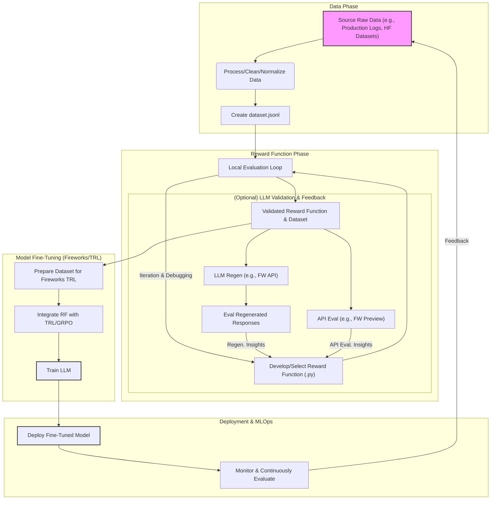

# Readiness Plan

## Overall Goal
Ensure the codebase is prepared by creating key examples: Math, Coding, Function Calling, and a Composite (Math + Coding) example. Each example must meet specific criteria for dataset handling, local evaluation, Fireworks API integration (preview and regeneration), TRL (GRPO focus), and integration testing. Examples should be structured in individual folders for clarity.

## Developer Journey with Reward-Kit

This diagram illustrates the typical end-to-end developer experience when using `reward-kit`:

---

## Relevant Files for Context
*   This document: `development/DEMO_READINESS.md` (This Overview)
*   Coding dataset generation script: `development/normalize_sandbox_fusion.py`
*   Coding dataset plan: `development/CODING_DATASET.md`
*   Generated coding dataset: `development/CODING_DATASET.jsonl`
*   Core reward functions:
    *   Math: `reward_kit/rewards/math.py`
    *   Coding: `reward_kit/rewards/code_execution.py` (especially `fractional_code_reward`)
    *   Function Calling: `reward_kit/rewards/function_calling.py` (especially `composite_function_call_reward`)
*   Evaluation utilities: `reward_kit/evaluation.py`
*   TRL integration examples: `examples/trl_integration/` (e.g., `grpo_example.py`, `minimal_deepcoder_grpo_example.py`)
*   End-to-end tests: `tests/test_examples_end_to_end.py` (to be expanded), `tests/test_readiness.py`

## Readiness Criteria (for each example)
0.  **Data Preparation & Cleaning (If Applicable):**
    *   Raw data sourced and processed/cleaned into the example's input `dataset.jsonl`.
    *   Scripts used for this process should be documented and runnable.
    *   Verification: `dataset.jsonl` is successfully generated.
1.  **Curated Dataset & Local Evaluation:**
    *   The generated `dataset.jsonl` passes 100% with the core reward function(s) locally.
    *   Organized in its own example folder (e.g., `examples/math_example/`, `examples/coding_example/`).
    *   Verification: Script execution shows 100% pass rate in output.
2.  **Fireworks Evaluator Preview API:**
    *   Dataset passes 100% using `preview_evaluation` API.
    *   Verification: Script execution shows 100% pass rate via API results in output.
3.  **Fireworks Regeneration & Evaluation (Qwen3):**
    *   Assistant responses regenerated using Fireworks Qwen3 model.
    *   Regenerated responses pass evaluation with core reward function(s).
    *   Verification: Script execution shows successful regeneration and high pass rate of new responses in output.
4.  **TRL Integration (GRPO Focus):**
    *   Reward function integrated into a GRPO TRL training loop.
    *   Script runs successfully for a few training steps.
    *   Verification: Script executes for specified steps without errors, logs indicate training progress.
5.  **End-to-End Integration Test:**
    *   Automated test that executes the example scripts (local eval, preview API with mocks, regeneration with mocks, TRL for minimal steps).
    *   Test verifies script exit codes and key output patterns indicating success.

---

## Example-Specific Readiness Plans:

*   [Math Example (GSM8K)](./readiness/math_gsm8k.md)
*   [Math Example (OpenR1)](./readiness/math_openr1.md)
*   [Coding Example](./readiness/coding_example.md)
*   [Function Calling Example](./readiness/function_calling_example.md)
*   [Composite Example (Math + Coding)](./readiness/composite_math_coding_example.md)
*   [Remote Evaluation with Secrets and Ngrok](./readiness/remote_evaluation_setup_plan.md)

---

## Cross-Cutting Refinements & E2E Testing Strategy:

*   [Cross-Cutting Refinements & Enhanced E2E Testing Strategy](./readiness/cross_cutting_refinements.md)

---
