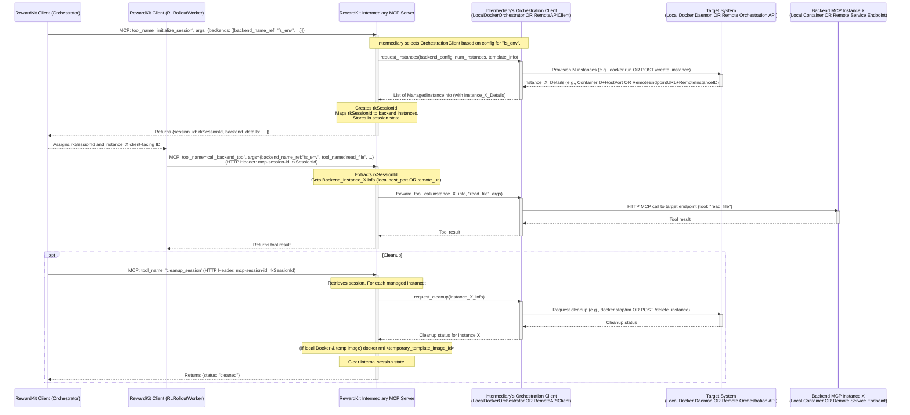

# Design: MCP Integration for Forkable and Proxied Backend Resources

## 1. Introduction

This document outlines the design for integrating diverse backend MCP server resources with the Model Context Protocol (MCP), primarily for use in Reinforcement Learning (RL) rollouts. The challenge is to provide isolated, "forkable" environments for stateful servers (like databases, filesystem views, or memory stores) while also offering efficient access to stateless or "embarrassingly parallel" utility servers (like web fetch or time services).

The solution involves an intermediary MCP server, to be developed as part of `reward-kit` (potentially as an optional package `reward-kit-mcp-agent`), named the `RewardKit-Intermediary-MCP-Server` (RK Intermediary Server). This server will abstract the complexities of managing these backend resources. It is designed to be flexible, supporting two primary modes for provisioning and interacting with backend instances:

1.  **Local Orchestration Mode:** The RK Intermediary Server directly manages the lifecycle of backend MCP server instances using **Docker** locally. This provides robust isolation and state forking capabilities (via Docker images and containers).
2.  **Remote Orchestration Proxy Mode:** The RK Intermediary Server acts as a client or proxy to a **customer-provided remote orchestration service** (e.g., a Kubernetes-based system, a custom API, or another higher-level MCP server). This remote service handles the actual provisioning and lifecycle of backend instances.

This dual-mode design ensures `reward-kit` can adapt to various customer environments and operational capabilities, whether they prefer local Docker-based management by the intermediary or integration with their existing remote resource provisioning systems.

This design covers various backend types, including:
*   **Stateful/Forkable (requiring isolated instances per session):** `filesystem`, `duckdb` (e.g., via `mcp-server-motherduck`), `memory` (knowledge graph), `everything` (comprehensive test server).
*   **Stateless/"Embarrassingly Parallel" (can use shared instances):** `fetch`, `time`.

The RK Intermediary Server will expose a unified set of MCP tools to the `RewardKit-Client`, allowing RL agents to interact with these diverse backend resources in a consistent manner, regardless of the underlying orchestration mode.

## 2. Core Architecture

The system involves three main participants:

1.  **`RewardKit-Client`**:
    *   An **Orchestrator**: Requests setup of backend environments (sessions with one or more backend instances) from the RK Intermediary Server.
    *   **`RLRolloutWorker` instances**: Perform RL rollouts, interacting with dedicated or shared backend instances via tools exposed by the RK Intermediary Server, using a session context.

2.  **`RewardKit-Intermediary-MCP-Server` (RK Intermediary Server)**:
    *   Determines orchestration mode (local Docker or remote proxy) based on configuration for each backend type.
    *   **In Local Orchestration Mode:** Acts as a Docker orchestrator. Manages the lifecycle of backend server Docker containers (run, commit for stateful templates, stop, remove).
    *   **In Remote Orchestration Proxy Mode:** Translates `RewardKit-Client` requests into API calls to a customer's remote orchestration service.
    *   Handles session management, mapping `RewardKit-Client` sessions to specific backend instances (local containers or remote service handles).
    *   Exposes MCP tools that abstract the underlying orchestration operations and tool forwarding.

3.  **`Resource Provisioning Environment`**: This can be:
    *   **Local Docker Environment**: Managed directly by the RK Intermediary Server. Requires Docker images for backend MCPs (e.g., from `/Users/bennychen/Documents/references/servers/`) and a Docker daemon accessible to the intermediary. Template data for stateful backends can be baked into images or mounted for `docker commit` workflows.
    *   **Remote Orchestration Service**: An API provided by the customer (e.g., Kubernetes-based, custom HTTP API, or a dedicated MCP orchestration server). The customer provides an API endpoint and authentication details for the RK Intermediary Server to request and manage remote backend instances.

### Overall Flow Diagram (Illustrating Dual Orchestration Modes)



## 3. Key Interaction Flows (Generalized for Orchestration Modes)

### 3.1. Session Initialization with Backend Instances
1.  The `RewardKit-Client` (Orchestrator) calls `initialize_session` on the `RK Intermediary Server`, specifying desired backends.
2.  The `RK Intermediary Server`, for each requested backend:
    *   Consults `AppConfig` to get the `BackendServerConfig` (including `orchestration_mode`).
    *   Selects the appropriate `OrchestrationClient` (e.g., `LocalDockerOrchestrationClient` or `RemoteHttpOrchestrationClient`).
    *   Calls the `OrchestrationClient` to provision `num_instances`.
        *   **Local Docker Mode (Stateful):** The client may trigger `docker commit` for template state, then `docker run` for instances, returning container info and mapped host ports.
        *   **Remote API Mode (Stateful):** The client makes API calls to the customer's service to create instances, returning remote endpoint URLs and instance IDs.
        *   **Stateless/Shared Mode (Local or Remote):** The client ensures a shared instance is running and returns its access details.
3.  The `RK Intermediary Server` creates an `IntermediarySession`, stores `ManagedInstanceInfo` (which now accommodates both local container and remote instance details) for all provisioned backends, and associates this with a new `rkSessionId`.
4.  Returns `rkSessionId` and instance details to the Orchestrator.

### 3.2. Rollout Interaction
1.  Orchestrator assigns `rkSessionId` and client-facing `instance_id`(s) to an `RLRolloutWorker`.
2.  `RLRolloutWorker` calls `call_backend_tool` on the `RK Intermediary Server` (with `rkSessionId` in header).
3.  `RK Intermediary Server` retrieves the `IntermediarySession`, identifies the target `ManagedInstanceInfo`.
4.  It uses the `OrchestrationClient` associated with that instance to forward the tool call:
    *   **Local Docker:** Makes an HTTP MCP call to `http://localhost:<host_port>/mcp`.
    *   **Remote API:** Makes an HTTP MCP call to the `remote_endpoint_url`.
5.  Result is returned to the `RLRolloutWorker`.

### 3.3. Session Cleanup
1.  Orchestrator calls `cleanup_session` (with `rkSessionId` in header).
2.  `RK Intermediary Server` retrieves session. For each managed instance, it calls the appropriate `OrchestrationClient` to terminate/delete the backend instance (local container stop/rm or remote API delete call).
3.  Temporary local Docker images (if any) are removed. Session object is deleted.

## 4. `RewardKit-Intermediary-MCP-Server` Design Details
(This section is now part of Section 8: Detailed Implementation Plan)

## 5. Resource Provisioning Environment Expectations

1.  **Common Requirement**: Access to backend MCP server definitions (e.g., executables, Docker images from sources like `/Users/bennychen/Documents/references/servers/`).
2.  **For Local Docker Orchestration Mode**:
    *   A Docker environment where the `RK Intermediary Server` can run and has permissions to interact with the Docker daemon.
    *   Backend MCP server Docker images should preferably expose an HTTP MCP transport.
    *   Template data (optional) for stateful backends, either baked into images or mountable for `docker commit` workflows.
3.  **For Remote Orchestration Proxy Mode**:
    *   A customer-provided remote orchestration API (e.g., Kubernetes-based, custom HTTP API, or another MCP server for orchestration).
    *   A clear API contract (endpoints, request/response schemas, authentication methods) for this remote service.
    *   The remote service is responsible for the actual lifecycle and state isolation of the backend instances it provisions.

## 6. Comparison with Original Examples

Original MCP servers (`filesystem`, `mcp-server-motherduck`, etc.) are typically standalone.
*   **Our Intermediary's Role**: It adds a layer of orchestration and session management.
    *   **Local Docker Mode**: It automates what one would do manually with Docker (commit, run, manage ports) to get isolated stateful instances.
    *   **Remote Proxy Mode**: It acts as a standardized client to potentially diverse customer-specific remote provisioning systems, presenting a consistent MCP interface to `RewardKit`.

## 7. Benefits
*   **Flexible Orchestration**: Supports both local Docker-based management and proxying to remote customer systems.
*   **Robust Isolation (Local Docker Mode)**: Strong isolation via Docker containers.
*   **Standardized Deployment (Local Docker Mode)**: Backend MCPs managed as containers.
*   **Simplified State Forking (Local Docker Mode)**: `docker commit` is a powerful primitive.
*   **Adaptability**: Can integrate with various customer infrastructure capabilities.

This design provides a scalable and maintainable solution for integrating forkable SQL database resources into the `reward-kit`'s RL evaluation workflows using MCP. The following section details a plan for implementing this solution.

## 8. Detailed Implementation Plan

This section outlines a phased approach to implement the `RewardKit-Intermediary-MCP-Server` within a new `reward_kit.mcp_agent` module. The implementation will leverage the MCP Python SDK found at `/Users/bennychen/Documents/references/python-sdk/src/mcp` for core server functionalities.

### 8.1. Module Structure (`reward_kit.mcp_agent`)

```
reward_kit/
└── mcp_agent/
    ├── __init__.py
    ├── intermediary_server.py  # Main RewardKitIntermediaryServer logic
    ├── orchestration/
    │   ├── __init__.py
    │   ├── base_client.py      # AbstractOrchestrationClient, ManagedInstanceInfo
    │   ├── local_docker_client.py # LocalDockerOrchestrationClient
    │   └── remote_http_client.py  # RemoteHttpOrchestrationClient (example for K8s/Custom API)
    ├── config.py               # Pydantic models for configuration
    ├── session.py              # Custom session class (IntermediarySession)
    ├── backends/
    │   ├── __init__.py
    │   ├── base.py             # AbstractBackendHandler
    │   ├── filesystem.py       # FileSystemBackendHandler
    │   ├── duckdb.py           # DuckDBBackendHandler
    │   ├── memory.py           # MemoryBackendHandler
    │   ├── everything.py       # EverythingBackendHandler
    │   └── proxy.py            # StatelessProxyBackendHandler (for fetch, time)
    └── main.py                 # CLI entry point for running the server (optional)

tests/
└── mcp_agent/
    ├── __init__.py
    ├── test_intermediary_server.py
    ├── orchestration/
    │   ├── test_local_docker_client.py
    │   └── test_remote_http_client.py
    ├── backends/
    │   ├── test_filesystem_backend.py
    │   # ... other backend handler tests
    └── mock_mcp_server_image/
        ├── Dockerfile
        └── mock_server.py # Generic mock MCP server for containerized testing
    └── mock_remote_orchestrator.py # Mock HTTP server for remote orchestration API
```

### 8.2. Core Components and Classes

1.  **`AppConfig` (in `config.py`)**:
    *   `backends: List[BackendServerConfig]`: Configurations for all backend types the intermediary can manage/proxy.
    *   `log_level: str`.
    *   `global_docker_options: Optional[Dict[str, Any]]` (e.g., default network).
    *   `global_remote_api_defaults: Optional[Dict[str, Any]]` (e.g., default timeouts for remote calls).

2.  **`RemoteApiConfig` (in `config.py`)**:
    *   Pydantic model for remote orchestration API details.
    *   `base_url: str`.
    *   `create_instance_endpoint: str` (e.g., `/instances`).
    *   `delete_instance_endpoint_template: str` (e.g., `/instances/{remote_instance_id}`).
    *   `call_tool_endpoint_template: Optional[str]` (If tool calls are also proxied via orchestrator, else direct to instance).
    *   `auth_type: Literal["none", "bearer_token", "custom_header"]`.
    *   `auth_details: Optional[Dict[str, str]]`.

3.  **`BackendServerConfig` (in `config.py`)**:
    *   `backend_name_ref: str` (Unique name, e.g., "workspace_fs", "shared_fetch_service").
    *   `backend_type: Literal["filesystem", "duckdb", "memory", "everything", "fetch", "time"]`.
    *   `orchestration_mode: Literal["local_docker", "remote_http_api"]`.
    *   `is_stateful_per_session: bool` (True for fs, duckdb, memory, everything. False for fetch, time - better: `instance_scoping: Literal["session", "shared_global"]`).
    *   **Local Docker Specific (`if orchestration_mode == 'local_docker'`):**
        *   `docker_image: str`.
        *   `container_port: int` (Internal port of MCP app in container, for HTTP).
        *   `template_data_path_host: Optional[str]` (For pre-seeding state).
        *   `container_template_data_path: Optional[str]` (Mount path for template data in setup container).
        *   `docker_run_args: Optional[List[str]]`.
        *   `startup_check_mcp_tool: Optional[Dict[str, Any]]`.
    *   **Remote API Specific (`if orchestration_mode == 'remote_http_api'`):**
        *   `remote_api_config_ref: Optional[str]` (Reference to a global `RemoteApiConfig` if shared, or inline).
        *   `remote_resource_type_identifier: str` (Type identifier for the remote API, e.g., "duckdb_v1", "filesystem_large").

4.  **`AbstractOrchestrationClient` (in `orchestration/base_client.py`)**:
    *   Interface:
        *   `async def provision_instances(backend_config: BackendServerConfig, num_instances: int, session_id: str, template_details: Optional[Any]) -> List[ManagedInstanceInfo]`.
        *   `async def deprovision_instances(instances: List[ManagedInstanceInfo])`.
        *   `async def call_tool_on_instance(instance: ManagedInstanceInfo, tool_name: str, tool_args: dict) -> dict`.

5.  **`LocalDockerOrchestrationClient(AbstractOrchestrationClient)` (in `orchestration/local_docker_client.py`)**:
    *   Uses Docker SDK for Python. Implements methods for `docker run`, `commit`, `stop`, `rm`, `rmi`, HTTP calls to container.
    *   Manages host port allocation.

6.  **`RemoteHttpOrchestrationClient(AbstractOrchestrationClient)` (in `orchestration/remote_http_client.py`)**:
    *   Uses `httpx` or `aiohttp`. Implements methods by calling configured remote API endpoints.

7.  **`ManagedInstanceInfo` (in `orchestration/base_client.py`)**:
    *   Stores all necessary details to interact with a provisioned backend instance.
    *   `instance_id: str` (Client-facing ID within a session).
    *   `backend_name_ref: str`.
    *   `orchestration_mode: Literal["local_docker", "remote_http_api"]`.
    *   `mcp_endpoint_url: str` (e.g., `http://localhost:<host_port>/mcp` or remote service URL).
    *   `internal_instance_details: Dict[str, Any]` (e.g., `{"container_id": "...", "host_port": ...}` or `{"remote_instance_id": "...", "access_token": "..."}`).
    *   `committed_image_tag: Optional[str]` (If local Docker and committed).

8.  **`IntermediarySession(mcp.server.BaseSession)` (in `session.py`)**:
    *   Stores `rk_session_id: str`.
    *   `managed_backends: Dict[str, List[ManagedInstanceInfo]]` (Keyed by `backend_name_ref`).
    *   `temporary_docker_images: List[str]` (For cleanup in local Docker mode).

9.  **`AbstractBackendHandler` (in `backends/base.py`)**:
    *   Now simpler: primarily validates `BackendInitRequest` against `BackendServerConfig`. The core orchestration logic moves to `OrchestrationClient`s.
    *   `async def initialize_session_instances(session: IntermediarySession, req: BackendInitRequest, server_cfg: BackendServerConfig, orch_client: AbstractOrchestrationClient) -> List[ManagedInstanceInfo]`.
    *   `async def cleanup_session_instances(session: IntermediarySession, backend_name_ref: str, orch_client: AbstractOrchestrationClient)`.

10. **Concrete `BackendHandler`s** (in `backends/*.py`):
    *   Their main role is to prepare any backend-specific template details for `OrchestrationClient.provision_instances` (e.g., for `docker commit` workflow if using local Docker) and handle any backend-specific interpretation of `ManagedInstanceInfo`.

11. **`RewardKitIntermediaryServer(mcp.server.Server)` (in `intermediary_server.py`)**:
    *   Initializes `OrchestrationClient`s (one `LocalDockerOrchestrationClient`, and one `RemoteHttpOrchestrationClient` per unique remote API config).
    *   Initializes `BackendHandler`s.
    *   Manages global shared instances for stateless backends (using the appropriate `OrchestrationClient`).
    *   Tool handlers select the correct `OrchestrationClient` and `BackendHandler` based on `BackendServerConfig.orchestration_mode` and `backend_type`.

### 8.3. Tool Definitions for Intermediary Server (Largely Unchanged from Client Perspective)

1.  **`initialize_session`**:
    *   Input: `backends: List[BackendInitRequest]` (as before, but `BackendInitRequest` might include `orchestration_preference: Optional[Literal["local_docker", "remote_http_api"]]` if a backend supports multiple modes).
    *   Output: `{ session_id: "<rk_session_id>", initialized_backends: List[BackendInitResult] }`.
    *   Action: Creates `IntermediarySession`. For each request, determines `OrchestrationClient` and calls `BackendHandler.initialize_session_instances`.

2.  **`call_backend_tool`**:
    *   Input: (as before).
    *   Action: Retrieves `IntermediarySession`. Finds `ManagedInstanceInfo`. Calls `OrchestrationClient.call_tool_on_instance()`.

3.  **`cleanup_session`**:
    *   Input: (as before).
    *   Action: Retrieves `IntermediarySession`. Calls `BackendHandler.cleanup_session_instances` for each managed backend, which in turn uses the `OrchestrationClient`.

### 8.4. Leveraging the MCP Python SDK & Dependencies
*   MCP Python SDK from `/Users/bennychen/Documents/references/python-sdk/src/mcp/` as a source dependency. `reward_kit.mcp_agent` as an optional extra.
*   Dependencies: `docker` (for local Docker), `httpx` or `aiohttp` (for remote API client).

### 8.5. Configuration (`reward_kit/mcp_agent/config.py`)
*   `BackendServerConfig` updated with `orchestration_mode` and `remote_api_config_ref`.
*   `AppConfig` includes list of `BackendServerConfig` and potentially list of `RemoteApiConfig` definitions.

### 8.6. Testing Strategy
*   **`OrchestrationClient` Unit Tests**:
    *   `LocalDockerOrchestrationClient`: Mock Docker SDK.
    *   `RemoteHttpOrchestrationClient`: Mock `httpx` calls.
*   **`BackendHandler` Unit Tests**: Mock `OrchestrationClient`.
*   **`RewardKitIntermediaryServer` Integration Tests**:
    *   Test with `LocalDockerOrchestrationClient` using `mock_mcp_server_image`.
    *   Test with `RemoteHttpOrchestrationClient` using `mock_remote_orchestrator.py` (a mock HTTP server simulating the customer's API).

### 8.7. Further Considerations
*   (As before: Resource Limits, Error Handling, Timeouts, Idempotency, Docker Security).
*   **Remote Orchestration API Contract**: If customers provide a remote orchestration API, a clear specification (or options for adapting to common ones like a K8s operator API) will be needed for the `RemoteHttpOrchestrationClient`.
*   **Authentication with Remote Orchestrators**: `RemoteApiConfig` needs robust auth handling.

This revised plan incorporates the flexibility to use either local Docker orchestration or proxy to remote orchestration services, making the `RewardKit-Intermediary-MCP-Server` more adaptable.
