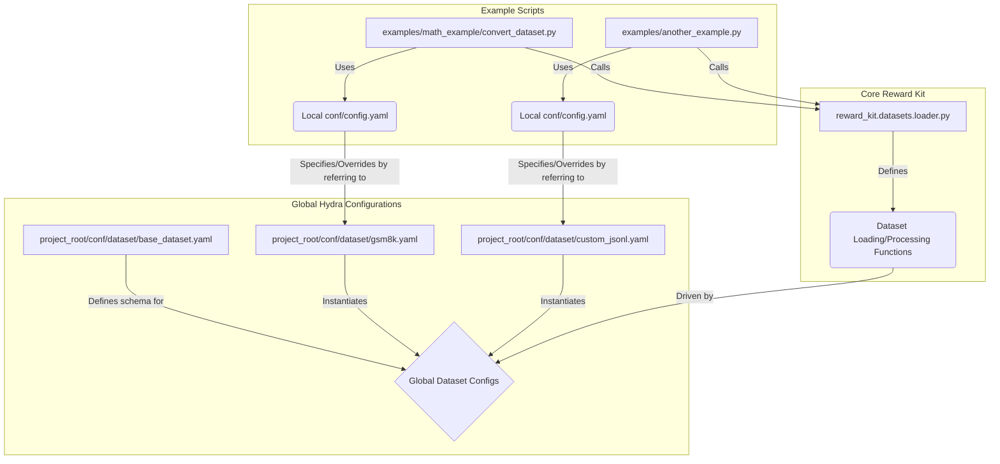

# Plan: Hydra for First-Class Dataset Management in Examples

This plan outlines the steps to refactor example scripts to use Hydra for dataset configuration, making datasets a "first-class citizen" in the codebase. This will improve consistency, reusability, and clarity for users.

**Phase 1: Core Dataset Handling Module & Hydra Schemas**

1.  **Define a Centralized Dataset Loading/Processing Logic:**
    *   Create a new Python module within the `reward_kit` core, perhaps `reward_kit/datasets/loader.py` or `reward_kit/data_handling.py`.
    *   This module will contain functions responsible for:
        *   Loading datasets from various sources (Hugging Face, local files like JSONL).
        *   Applying common preprocessing steps (e.g., formatting messages, extracting specific columns based on configuration).
        *   Potentially caching datasets.
    *   The functions in this module will be driven by Hydra configurations.

2.  **Design Hydra Configuration Schemas for Datasets:**
    *   Define structured configs (e.g., using dataclasses with `hydra_zen` or just well-defined YAML structures) for datasets. This promotes type safety and discoverability.
    *   A base dataset schema might include:
        *   `source_type`: (e.g., `huggingface`, `jsonl_file`)
        *   `path_or_name`: (HF dataset name or local file path)
        *   `split`: (e.g., `train`, `test`, `validation`)
        *   `config_name`: (for HF datasets with multiple configs)
        *   `preprocessing_steps`: (list of preprocessing functions/configs to apply)
        *   `column_mapping`: (flexible mapping for `query`, `solution`, `ground_truth`, etc., if needed beyond defaults)
    *   Example schema structure in YAML (to be potentially backed by Python dataclasses):
        ```yaml
        # conf/dataset/base_dataset.yaml (abstract base)
        _target_: reward_kit.datasets.loader.load_and_process_dataset # Points to the new central loader
        source_type: ???
        path_or_name: ???
        split: "train"
        config_name: null
        column_mapping:
          query: "problem"
          solution: "solution" # Or assistant_response
          ground_truth: "answer" # Or expected_output
        # Add other common fields like max_samples, shuffle, etc.
        ```
        ```yaml
        # conf/dataset/gsm8k.yaml
        defaults:
          - base_dataset
        source_type: huggingface
        path_or_name: "gsm8k"
        config_name: "main"
        # Override column_mapping if gsm8k uses different names
        ```
        ```yaml
        # conf/dataset/custom_jsonl.yaml
        defaults:
          - base_dataset
        source_type: jsonl_file
        path_or_name: "path/to/my/data.jsonl" # Can be relative to a data root or absolute
        ```

3.  **Refactor `examples/math_example/convert_dataset.py` (Already Partially Done):**
    *   This script now uses Hydra. We can further refine its configuration to use the new structured dataset schema from a central `conf/dataset/` location.
    *   Instead of many top-level dataset parameters in its local `config.yaml`, it would have a nested `dataset` group that refers to a global dataset config:
        ```yaml
        # examples/math_example/conf/config.yaml (updated)
        defaults:
          - dataset: gsm8k # Points to project_root/conf/dataset/gsm8k.yaml
          - _self_

        # ... (processing and output sections remain)

        # The 'dataset' group will be populated from the global dataset config
        dataset:
          # Parameters here can override those from the chosen dataset default
          split: "test" # Example override
        ```
    *   The `convert_dataset.py` script would then access dataset parameters via `cfg.dataset.path_or_name`, `cfg.dataset.split`, etc.

**Phase 2: Refactor Other Example Scripts**

1.  **Identify Example Scripts for Refactoring:**
    *   Go through the `examples/` directory. Scripts that load or process datasets are candidates.
    *   Examples:
        *   `examples/math_example/local_eval.py`
        *   `examples/math_example_openr1/trl_grpo_integration.py` (and other TRL examples)
        *   `examples/folder_based_evaluation_example.py` (for its sample file loading)
        *   Any script that currently hardcodes dataset paths or has its own `load_dataset` logic.

2.  **For each identified script:**
    *   **Introduce Hydra:** Add the `@hydra.main` decorator and necessary imports.
    *   **Create a `conf` directory and `config.yaml` locally within the example's directory.**
    *   **Define a `dataset` group in its local `config.yaml`:** This group will allow users to specify which pre-defined dataset config (from the global `project_root/conf/dataset/`) to use, or override parameters.
        ```yaml
        # e.g., examples/math_example_openr1/conf/config.yaml
        defaults:
          - dataset: openr1_math_220k # Assuming project_root/conf/dataset/openr1_math_220k.yaml exists
          - _self_

        # Script-specific parameters (e.g., model, training args)
        model_name: "Qwen/Qwen2-0.5B-Instruct"
        # ... other script params

        dataset:
          # Overrides for the openr1_math_220k default if needed
          max_samples: 500
        ```
    *   **Modify the script to use `cfg.dataset`:**
        *   Call the central dataset loader: `loaded_data = hydra.utils.instantiate(cfg.dataset)`
        *   This `loaded_data` would be the processed dataset ready for use by the example script.
    *   Remove old `argparse` or manual path handling for datasets.

**Phase 3: Documentation & Best Practices**

1.  **Update `CONTRIBUTING.md` or create a new guide:**
    *   Explain the new dataset configuration system.
    *   Show how to define new dataset configs in the global `project_root/conf/dataset/`.
    *   Provide examples of how to run scripts with different dataset configurations via Hydra CLI overrides.
2.  **Add READMEs to example directories:** Explain how to run each example using its Hydra config.

**Benefits of this approach:**

*   **Consistency:** All examples will use a standardized way to load and configure datasets.
*   **Reusability:** Dataset definitions (global `conf/dataset/*.yaml`) can be reused across multiple examples.
*   **Clarity:** Users can easily see and modify dataset configurations without digging into script code.
*   **Flexibility:** Hydra's command-line overrides and composition make it easy to experiment with different datasets or parameters.
*   **Centralized Logic:** The core dataset loading and preprocessing logic is maintained in one place (e.g., `reward_kit.datasets.loader`).

**Diagrammatic Overview:**



**Key Considerations from Discussion:**

*   **Location of `conf/dataset/`:** A root-level `project_root/conf/dataset/` is preferred for global dataset definitions, making them "first-class citizens".
*   **Dataclass Schemas vs. Pure YAML:** Using Python dataclasses (e.g., with `hydra_zen`) for config schemas is a good practice for validation and IDE support, potentially for a later refinement.
*   **Initial Focus:** Start by creating the `reward_kit.datasets.loader` module and a couple of basic global dataset configs. Then refactor one or two example scripts to use this new system.
