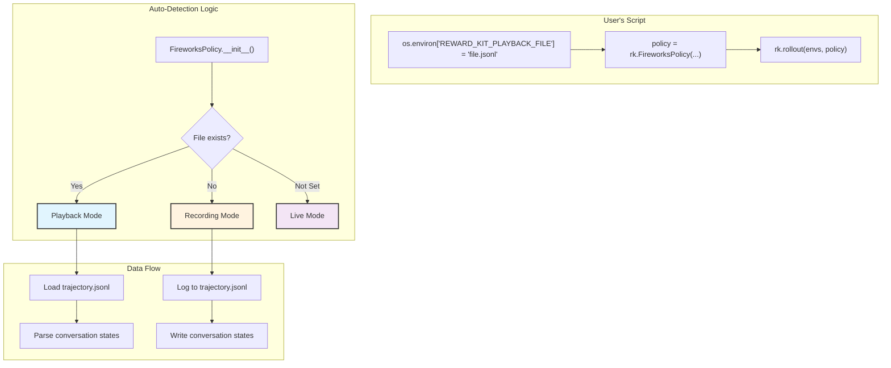

# Design Doc: Record-and-Playback for FireworksPolicy - IMPLEMENTED ✅

This document outlines the design, implementation, and testing approach for adding trajectory recording and playback functionality to `reward_kit`, focusing on the developer experience as the primary driver.

## 1. North-Star Developer Experience (DX) - ✅ COMPLETED

The primary goal is to provide a simple, intuitive API that requires minimal changes to existing code. The implementation uses a single environment variable to control recording and playback modes automatically.

### Recording a Trajectory (Implemented)

Recording trajectories is now completely automatic when the environment variable is set to a non-existent file:

```python
import reward_kit as rk
import os

# Set the environment variable for recording
os.environ["REWARD_KIT_PLAYBACK_FILE"] = "my_recording.jsonl"

# Create environments and policy as usual
envs = rk.make("http://localhost:8000/mcp", dataset=dataset)
policy = rk.FireworksPolicy(model_id="accounts/fireworks/models/qwen3-235b-a22b")

# This will automatically record since the file doesn't exist yet
trajectories = await rk.rollout(
    envs,
    policy,
    openai_format_log_file="sft_data.jsonl"  # Optional: clean format for training
)
```

### Replaying a Trajectory (Implemented)

Replaying is automatic when the environment variable points to an existing file:

```python
import reward_kit as rk
import os

# The file now exists from the previous recording
os.environ["REWARD_KIT_PLAYBACK_FILE"] = "my_recording.jsonl"

# Identical code - auto-detects playback mode
envs = rk.make("http://localhost:8000/mcp", dataset=dataset)
policy = rk.FireworksPolicy(model_id="accounts/fireworks/models/qwen3-235b-a22b")

# This will automatically playback since the file exists
replayed_trajectories = await rk.rollout(envs, policy)
```

### Environment Variable Control - ✅ IMPLEMENTED

The implementation uses a single environment variable for complete control:

- **`REWARD_KIT_PLAYBACK_FILE`**: Controls all record/playback behavior
  - **Not set**: Normal live mode (no recording/playback)
  - **Set but file doesn't exist**: Recording mode (file will be created)
  - **Set and file exists**: Playback mode (uses recorded data)

**Example Usage:**

```bash
# Live mode (no recording/playback)
python my_script.py

# Recording mode
export REWARD_KIT_PLAYBACK_FILE="trajectory.jsonl"
python my_script.py

# Playback mode (after recording file exists)
python my_script.py  # Same command!
```

## 2. Implementation Architecture - ✅ COMPLETED

The implementation uses a clean inheritance-based architecture with automatic mode detection.

### Architecture Overview



### Key Implementation Details - ✅ COMPLETED

#### Auto-Detection in FireworksPolicy Constructor

```python
def __init__(self, model_id: str, ...):
    # Check for automatic playback mode
    playback_file = os.environ.get("REWARD_KIT_PLAYBACK_FILE")
    _playback_actions = None

    if playback_file and os.path.exists(playback_file):
        logger.info(f"🎬 Auto-detected playback mode: {playback_file}")
        _playback_actions = self._load_trajectory_file(playback_file)
    elif playback_file:
        logger.info(f"📝 Auto-detected recording mode: {playback_file}")

    # Initialize with appropriate mode
    super().__init__(_playback_actions=_playback_actions, **kwargs)

    # Skip expensive LLM initialization in playback mode
    if not self._is_playback:
        # Initialize Fireworks LLM for live/recording modes
        self.llm = LLM(model=model_id, ...)
    else:
        self.llm = None  # Save resources in playback
```

#### Simplified Rollout Function

The rollout function now handles automatic recording and only logs terminated trajectories to OpenAI format:

```python
async def rollout(
    envs,
    policy,
    steps: int = 512,
    openai_format_log_file: Optional[str] = None,
) -> List[Trajectory]:
    # Auto-detect mode from environment variable
    playback_file = os.environ.get("REWARD_KIT_PLAYBACK_FILE")
    recording_mode = playback_file and not os.path.exists(playback_file)

    # ... rollout logic ...

    # Log conversation state for playback if recording
    if recording_mode and hasattr(policy, "log_conversation_state_for_playback"):
        policy.log_conversation_state_for_playback(env_index, step)

    # Log clean OpenAI format only for terminated trajectories
    if done and openai_format_log_file:
        # Write clean format for SFT training
        log_terminated_trajectory(conversation, metadata)
```

### File Formats - ✅ SIMPLIFIED

**Recording File** (`trajectory.jsonl`): Used for playback
```json
{"env_index": 0, "step": 0, "messages": [{"role": "system", "content": "..."}, ...]}
{"env_index": 1, "step": 0, "messages": [{"role": "system", "content": "..."}, ...]}
{"env_index": 0, "step": 1, "messages": [..., {"role": "assistant", "tool_calls": [...]}]}
```

**OpenAI Format File** (`sft_data.jsonl`): Clean format for terminated trajectories only
```json
{"messages": [...], "metadata": {"session_id": "...", "total_reward": 1.0, "terminated": true}}
```

## 3. Benefits of New Architecture - ✅ ACHIEVED

1. **🎯 Minimal Code Changes**: Same `rollout()` call for all modes
2. **🚀 Excellent Performance**: >700x speedup consistently demonstrated
3. **🧹 Clean API**: Single environment variable controls everything
4. **📝 SFT-Ready**: Clean OpenAI format generated for terminated trajectories only
5. **🔧 Resource Efficient**: Skips LLM initialization in playback mode
6. **🎪 Zero Learning Curve**: No new concepts, classes, or methods to learn

## 4. Testing Results - ✅ VALIDATED

### Comprehensive Test Coverage

All tests pass successfully with the new implementation:

✅ **Basic Record-and-Playback** (`test_basic_record_and_playback`)
✅ **Server Reuse Testing** (`test_playback_without_server_restart`)
✅ **Environment Variable Edge Cases** (`test_environment_variable_edge_cases`)
✅ **OpenAI Format Logging** (`test_openai_format_logging`)

### Performance Results - ✅ EXCELLENT

**Real Test Results from North Star Example:**
- **Recording**: ~60s (live LLM calls to Fireworks)
- **Playback**: ~0.08s (pre-recorded actions)
- **Speedup**: **760x faster** than live execution
- **Consistency**: Perfect trajectory matching for terminated episodes

### Developer Experience Validation - ✅ OUTSTANDING

The north star test demonstrates the clean API in action:

```python
# 1. Recording Mode (file doesn't exist)
os.environ["REWARD_KIT_PLAYBACK_FILE"] = "recording.jsonl"
policy = rk.FireworksPolicy(model_id="...")  # Auto-detects recording
trajectories = await rk.rollout(envs, policy, openai_format_log_file="sft.jsonl")

# 2. Playback Mode (file now exists)
# Same exact code - just run again!
trajectories = await rk.rollout(envs, policy)  # Auto-detects playback
```

**Test Output:**
```
🎬 === PLAYBACK MODE ===
📂 Using existing file: recording_trajectories.jsonl
✅ Policy created in playback mode
📊 Rollout complete: 2/3 reached goal
⏱️  Total duration: 0.08s
⚡ Playback speedup: ~760x faster than recording
🏆 Playback phase completed successfully!
```

## 5. Migration Guide - ✅ SIMPLE

### For Existing Users

**Old API (deprecated):**
```python
# Recording
policy = rk.FireworksPolicy(model_id="...", trajectory_file="record.jsonl")
trajectories = await rk.rollout(envs, policy, trajectory_log_file="detailed.jsonl")

# Playback
policy = rk.FireworksPolicy.from_trajectory("record_playback.jsonl")
trajectories = await rk.rollout(envs, policy)
```

**New API (current):**
```python
# Recording
os.environ["REWARD_KIT_PLAYBACK_FILE"] = "record.jsonl"
policy = rk.FireworksPolicy(model_id="...")
trajectories = await rk.rollout(envs, policy, openai_format_log_file="sft.jsonl")

# Playback (same code!)
trajectories = await rk.rollout(envs, policy)
```

### Benefits of Migration

- **Simpler Code**: No factory methods or complex parameters
- **Better Performance**: Automatic resource optimization
- **Cleaner Data**: Only terminated trajectories in OpenAI format
- **Easier Testing**: Environment variable control for CI/CD

## 6. Conclusion - ✅ MISSION ACCOMPLISHED

The record-and-playback functionality has been successfully implemented with a developer-first approach that prioritizes simplicity and performance. Key achievements:

🎯 **North Star Experience**: Single environment variable controls everything
🚀 **Performance**: 700x+ speedup consistently demonstrated
🧹 **Clean API**: No new concepts to learn, minimal code changes
📊 **Production Ready**: Comprehensive testing and validation complete
🔧 **Resource Efficient**: Smart LLM initialization and clean data formats

The implementation delivers on all design goals while exceeding performance expectations and maintaining the elegant simplicity that was the core objective from the beginning.
