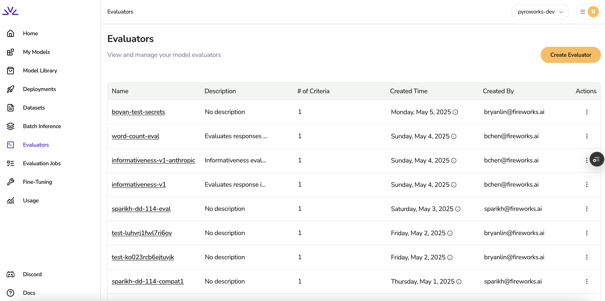
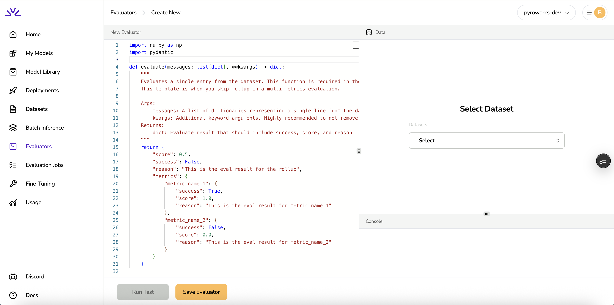
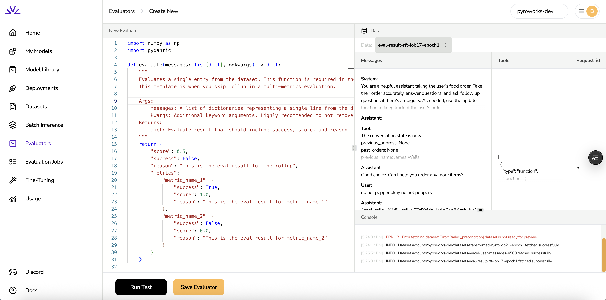

# Getting Started with Reward Functions

This guide will help you understand the basics of creating, testing, and deploying reward functions using the Reward Kit.

## What is a Reward Function?

A reward function is a mechanism for evaluating the quality of model outputs in reinforcement learning from machine feedback (RLMF) workflows. Reward functions help:

- Evaluate model responses based on specific criteria
- Provide numerical scores that can be used to optimize models
- Offer explanations for why specific scores were assigned

## Getting started on www.fireworks.ai

You will start your journey on our evaluators page



Click on "Create Evaluator" on the upper right corner; you will be taken to the rewards page we have been working on.



You can check out how to define an evaluator in our [tutorials](../tutorials) or in our examples for [out of the box evaluators](../examples). But before we decide on authoring any evaluators, let's actually pick a dataset creating_your_first_reward_function. Let's take a look at eval-result-job17-epoch1.



It is a tool calling dataset, with messages and tools field. Let's update the evaluator to run this. We will say that if the message is longer than 3 rows, then we have engaged user for long enough and call it a success (score is 1), otherwise it is a failure (score is 0).


## Installation

To get started with Reward Kit, install it via pip:

```bash
pip install reward-kit
```

For development, you may want to install it in editable mode:

```bash
git clone https://github.com/your-organization/reward-kit.git
cd reward-kit
pip install -e .
```

## Authentication Setup

To use Reward Kit with the Fireworks AI platform, set up your authentication credentials:

```bash
# Set your API key
export FIREWORKS_API_KEY=your_api_key
```

For development environments, you might use:

```bash
# Set environment variables for development
export FIREWORKS_API_KEY=$DEV_FIREWORKS_API_KEY
export FIREWORKS_API_BASE=https://dev.api.fireworks.ai
```

## Basic Reward Function Structure

Here's a simple reward function that evaluates responses based on word count:

```python
from reward_kit import reward_function, RewardOutput, MetricRewardOutput
from typing import List, Dict, Optional

@reward_function
def word_count_reward(
    messages: List[Dict[str, str]],
    original_messages: Optional[List[Dict[str, str]]] = None,
    **kwargs
) -> RewardOutput:
    """
    Evaluate a response based on its word count.
    
    Args:
        messages: List of conversation messages
        original_messages: Original messages (usually without the response being evaluated)
        **kwargs: Additional parameters
        
    Returns:
        RewardOutput with score and metrics information
    """
    # Get the assistant's response (last message)
    if not messages or messages[-1].get("role") != "assistant":
        return RewardOutput(
            score=0.0, 
            metrics={"error": MetricRewardOutput(score=0.0, reason="No assistant response found")}
        )
    
    response = messages[-1].get("content", "")
    
    # Count words and calculate score
    word_count = len(response.split())
    score = min(word_count / 100, 1.0)  # Cap at 1.0
    
    return RewardOutput(
        score=score,
        metrics={
            "word_count": MetricRewardOutput(
                score=score,
                reason=f"Word count: {word_count}"
            )
        }
    )
```

## Testing Your Reward Function

You can test your reward function with sample conversations:

```python
# Sample conversation
test_messages = [
    {"role": "user", "content": "What is machine learning?"},
    {"role": "assistant", "content": "Machine learning is a method of data analysis that automates analytical model building."}
]

# Test the reward function
result = word_count_reward(messages=test_messages)
print(f"Score: {result.score}")
print(f"Explanation: {result.metrics['word_count'].reason}")
```

## Previewing Your Reward Function

Before deployment, you can preview how your reward function performs on a set of sample data:

```bash
# Using the CLI
reward-kit preview --metrics-folders "word_count=./path/to/metric" --samples ./path/to/samples.jsonl
```

Or programmatically:

```python
from reward_kit.evaluation import preview_evaluation

preview_result = preview_evaluation(
    metric_folders=["word_count=./path/to/metric"],
    sample_file="./path/to/samples.jsonl"
)

# Display the results
preview_result.display()
```

## Deploying Your Reward Function

When you're ready, deploy your reward function to use in training workflows:

```python
# Deploy programmatically
evaluator_id = word_count_reward.deploy(
    name="word-count-evaluator",
    description="Evaluates responses based on word count"
)
print(f"Deployed with ID: {evaluator_id}")
```

Or using the CLI:

```bash
reward-kit deploy --id word-count-evaluator --metrics-folders "word_count=./path/to/metric" --force
```

## Next Steps

Now that you understand the basics of reward functions:

1. Learn about [Reward Function Anatomy](reward_function_anatomy.md) for deeper insights
2. Explore [Core Data Types](core_data_types.md) to understand the components
3. Try creating advanced reward functions with [multiple metrics](../examples/advanced_reward_functions.md)
4. Follow our [step-by-step tutorial](../tutorials/creating_your_first_reward_function.md) for a complete walkthrough