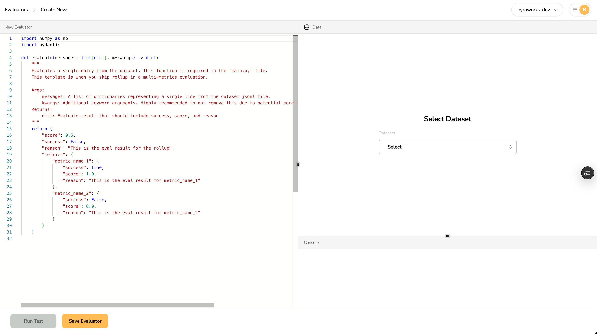

# Reward Kit Documentation

Welcome to the Reward Kit documentation. This guide will help you create, test, and deploy reward functions for evaluating and optimizing LLM responses.

## Getting Started

### Developer Guide
- [Getting Started with Reward Functions](developer_guide/getting_started.mdx): Learn the basics of reward functions.
- [Reward Function Anatomy](developer_guide/reward_function_anatomy.mdx): Understand the structure of reward functions.
- [Core Data Types](developer_guide/core_data_types.mdx): Explore the data models used in reward functions.
- [Evaluation Workflows](developer_guide/evaluation_workflows.mdx): Learn the complete lifecycle from development to deployment.
- [Dataset Configuration Guide](dataset_configuration_guide.md): Understand how to configure datasets using YAML.
- [Hydra Configuration for Examples](developer_guide/hydra_configuration.mdx): Learn how Hydra is used for configuration in examples.

### Examples
- [Examples Overview](examples/examples_overview.mdx): Browse available examples and learn how to run them. The primary documentation for each example is its own `README.md` in the `examples/` directory.

### Tutorials
- [Creating Your First Reward Function](tutorials/creating_your_first_reward_function): Step-by-step guide to creating a reward function

## API Reference
- [API Overview](api_reference/api_overview.mdx)
- [RewardFunction Class](api_reference/reward_function_class.mdx)
- [Reward Function Decorator](api_reference/reward_function_decorator.mdx)
- [Data Models](api_reference/data_models.mdx)

## Command Line Interface
- [CLI Overview](cli_reference/cli_overview.mdx)

## Best Practices
- [Best Practices for Reward Functions](tutorials/best_practices.mdx)

## Community and Support
- GitHub Issues: Report bugs and request features
- Contributing Guide: How to contribute to the Reward Kit project
