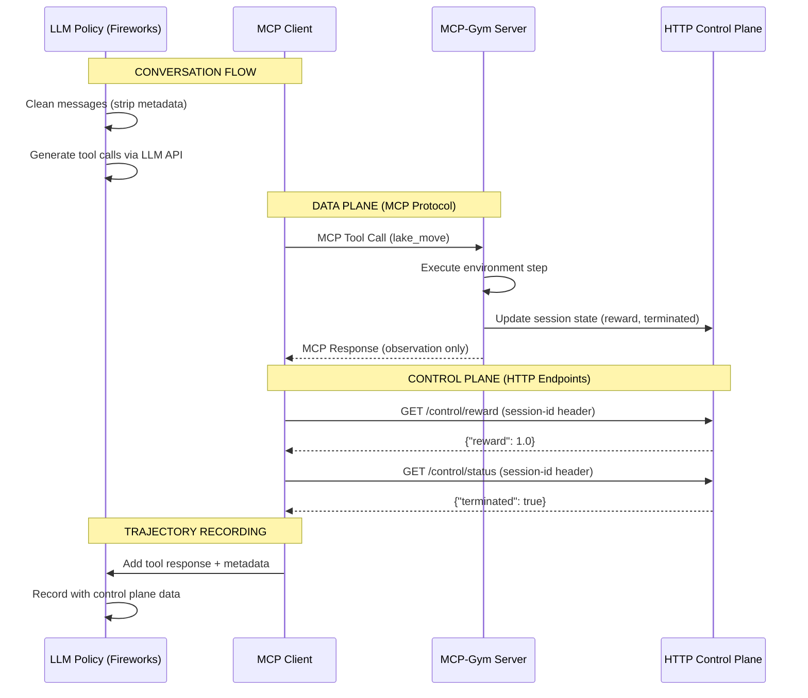

# Part 2: Core Architecture

The Reward Protocol's power lies in its simple yet robust architecture, designed to cleanly separate the flow of information between the agent and the environment. This design solves critical issues in traditional RL setups, enabling reproducible, scalable, and production-ready systems.

## 2.1 The Dual-Plane Architecture

A core design principle of the Reward Protocol is the separation of the **Data Plane** and the **Control Plane**.

*   **Data Plane (MCP):** This is where the primary agent-environment interaction happens. The agent (LLM Policy) sends tool calls (e.g., `lake_move`) to the MCP-Gym Server. The server executes the action and returns an **observation** back to the agent. This channel is designed to be clean and simple, containing only the information the LLM needs to decide its next action.

*   **Control Plane (HTTP):** This is an out-of-band channel used to transmit metadata essential for the RL training loop but not for the agent's immediate decision-making. This includes the `reward`, `terminated` status, and other diagnostic `info`. The MCP Client queries simple HTTP endpoints on the server to retrieve this data after an action is taken.

This separation is critical:
1.  **Keeps the LLM's context clean:** The model's prompt is not cluttered with reward or status data that it doesn't need, improving inference quality.
2.  **Mimics production environments:** In real-world scenarios, reward signals often come from separate systems (e.g., user feedback, business metrics).
3.  **Enables standardized data collection:** The control plane provides a consistent way to gather data for training and evaluation, regardless of the environment's nature.

The diagram below illustrates this flow:

## 2.2 Session Isolation

To run experiments and evaluations reliably, it's crucial to manage multiple, independent, and reproducible environment instances concurrently. MCP-Gym handles this through **session isolation**.

When a client connects, it can specify a `seed` and other `config` parameters. The framework uses this information to generate a unique `session-id`. This `session-id` is then passed as a header in both MCP tool calls (on the Data Plane) and HTTP requests (on the Control Plane).

The `GymProductionServer` uses this `session-id` to maintain a separate environment instance and state for each client session. This ensures that:
-   Multiple agents can interact with the same environment type without interfering with each other.
-   Experiments are reproducible by using the same `seed`.
-   The server can manage the lifecycle of each environment instance independently.

This mechanism is fundamental to enabling scalable, parallel rollouts for training and large-scale evaluation.
